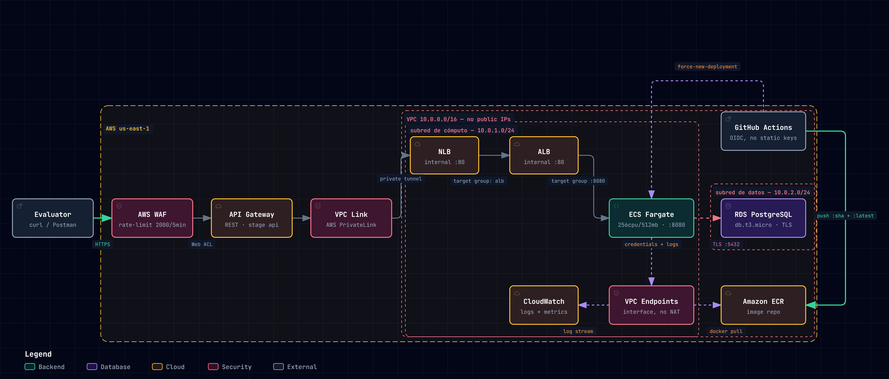

# Infraestructura

Arquitectura, estructura del repositorio y despliegue. Ver el [README](./README.md) para los datos de evaluación rápida y cómo correr el proyecto localmente.

## Objetivo

Diseñar, aprovisionar y desplegar en AWS una arquitectura completa para un microservicio web contenerizado, dentro de los límites de AWS Free Tier, implementando el siguiente flujo de tráfico y seguridad perimetral:

```
Internet → AWS WAF → API Gateway (REST) → VPC Link → ALB Interno → ECS Fargate → RDS PostgreSQL
```

## Arquitectura



### Resumen del flujo de tráfico

```
Cliente → AWS WAF → API Gateway → VPC Link (AWS PrivateLink) → NLB → ALB Interno → ECS Fargate → RDS PostgreSQL
```

En paralelo, fuera del camino de tráfico en tiempo real, corre el pipeline de despliegue:

```
GitHub Actions (build/test/terraform validate) → Amazon ECR (push, tag = commit SHA + latest) → Amazon ECS (nueva task definition por SHA, rollback-able)
```

## Estructura del repositorio

```
.
├── app/                     # API mínima (health + info)
│   ├── src/                     # hexagonal: domain / application / infrastructure
│   ├── Dockerfile               # multi-stage, non-root, HEALTHCHECK
│   ├── package.json
│   ├── pnpm-workspace.yaml      # políticas de supply-chain de pnpm 12
│   ├── .env.example
│   └── README.md            # Detalles de implementación: capas hexagonales, env vars, tests
├── terraform/               # IaC: VPC, WAF, API Gateway, VPC Link, NLB, ALB, ECS, ECR, RDS, IAM
├── docs/
│   └── fya-prueba-tecnica-architecture.jpeg  # Diagrama de arquitectura
├── .github/workflows/
│   └── deploy.yml           # build → test → terraform validate → push a ECR → deploy versionado a ECS
├── docker-compose.yml       # stack local (app + Postgres)
├── .env.example
├── TROUBLESHOOTING.md       # respuestas al Anexo 1 (casos de soporte)
├── INFRASTRUCTURE.md        # este archivo
└── README.md
```

## CI/CD

`.github/workflows/deploy.yml` corre en cada push a `main`:

1. **`validate`**: instala dependencias, hace lint, corre los tests, compila la app (`app/`), y valida el Terraform (`fmt -check` + `validate`, sin credenciales AWS).
2. **`deploy`** (solo si `validate` pasa): se autentica en AWS vía OIDC (sin credenciales de larga duración), construye la imagen Docker etiquetada con el commit SHA y `latest`, sube ambas a ECR, registra una nueva revisión de task definition con la imagen fijada al SHA, actualiza el servicio de ECS a esa revisión y espera a que estabilice. Cada deploy queda como una revisión distinta y reversible (`aws ecs update-service --task-definition <family>:<rev-anterior>`), a diferencia de reiniciar siempre sobre el tag mutable `:latest`.

Después de correr `terraform apply` en `terraform/`, obtén los valores que necesita el workflow:

```bash
terraform output github_actions_role_arn
terraform output ecr_repository_url
terraform output ecs_cluster_name
terraform output ecs_service_name
```

Configúralos como **repository variables** (Settings → Secrets and variables → Actions → Variables — no Secrets, ninguno de estos es sensible):

| Variable | Valor |
|---|---|
| `AWS_ROLE_ARN` | `terraform output github_actions_role_arn` |
| `ECR_REPOSITORY_URL` | `terraform output ecr_repository_url` |
| `ECS_CLUSTER_NAME` | `terraform output ecs_cluster_name` |
| `ECS_SERVICE_NAME` | `terraform output ecs_service_name` |

## Estado de Terraform

Remoto, en S3 (`terraform/versions.tf`, backend `s3`, con locking nativo `use_lockfile`, sin DynamoDB). No hay `.tfstate` local.

## Hardening adicional

- WAF: además del rate-limit, la regla gestionada `AWSManagedRulesCommonRuleSet` de AWS (OWASP Top 10).
- RDS: cifrada en reposo (`storage_encrypted`), TLS verificado contra el bundle de CA de AWS (no solo cifrado, valida el certificado real).
- App: cabeceras de seguridad (`helmet`), apagado ordenado en `SIGTERM`/`SIGINT`, manejo de errores del pool de Postgres, redacción de headers sensibles en logs.
